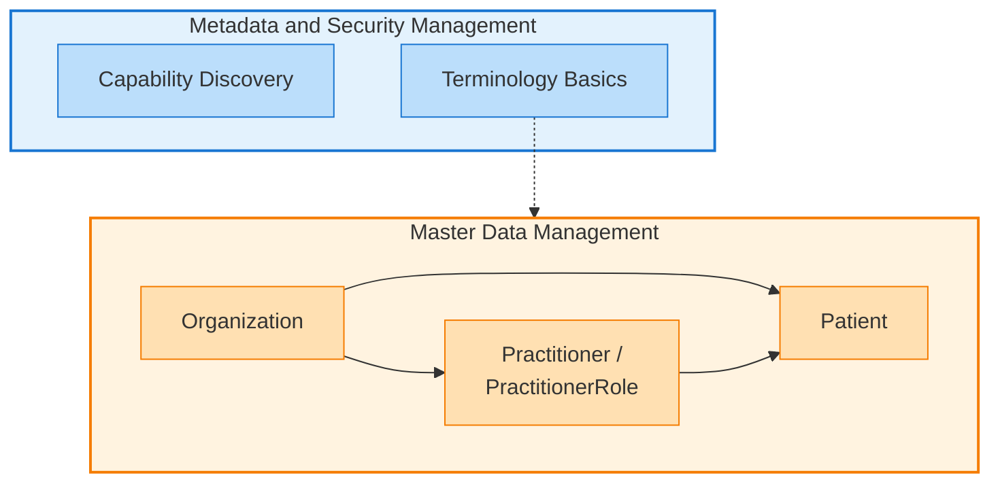

# Добро пожаловать на первый коннектатон DHP

### Обзор

Добро пожаловать на первый коннектатон Цифровой Платформы Здравоохранения (ЦПЗ)! Это мероприятие направлено на тестирование и интеграцию с двумя основными компонентами информационной системы здравоохранения Узбекистана:

- **MSM (Управление метаданными и безопасностью)**: понимание возможностей сервера и терминологических сервисов
- **MDM (Управление мастер-данными)**: работа с основными данными здравоохранения, включая организации, пациентов и практикующих врачей

Будущие коннектатоны будут охватывать дополнительные компоненты ЦПЗ по мере их появления для интеграции.

### Что такое FHIR?

FHIR (Fast Healthcare Interoperability Resources) - это международный стандарт для электронного обмена медицинской информацией. Думайте о нем как об общем языке, который позволяет различным системам здравоохранения общаться друг с другом.

Ключевые концепции:
- **Ресурсы**: Стандартизированные структуры данных (Patient, Organization, Practitioner и т.д.)
- **RESTful API**: Используйте стандартные HTTP-методы (GET, POST, PUT, DELETE) для взаимодействия с данными
- **Профили**: Настройки базовых ресурсов FHIR для конкретных случаев использования (например, uz-core профили для Узбекистана)
- **Терминология**: Стандартизированные системы кодов и наборы значений для согласованного представления данных

Базовый URL для тестирования: `https://playground.dhp.uz/fhir`
- Примечание: Это временный URL, который будет заменен ближе к коннектатону

### Чему вы научитесь

Этот коннектатон поможет вам:

1. Регистрировать пациентов - Обрабатывать записи пациентов с обнаружением дубликатов и сопоставлением
1. Управлять организациями - Создавать, читать, обновлять, удалять и искать медицинские организации
1. Управлять практикующими врачами - Работать с медицинскими работниками и их ролями в организациях
1. Обнаруживать возможности - Запрашивать, что поддерживает сервер, используя CapabilityStatement
1. Использовать терминологические сервисы - Искать и проверять коды, используя CodeSystem, ValueSet и ConceptMap

### Сценарии

Мы подготовили подробные сценарии для каждой задачи интеграции. Выберите порядок, который лучше всего подходит для потребностей вашего приложения:

#### [Регистрация пациентов](patient-registration.html)
Обработка записей пациентов с правильными идентификаторами (ПИНФЛ), обнаружение дубликатов и логика сопоставления.

Навыки: поиск и сопоставление пациентов, обнаружение дубликатов, качество данных

#### [Управление организациями](organization-management.html)
Управление медицинскими организациями и отделениями.

Навыки: CRUD операции, поиск, ссылки, идентификаторы, иерархии

#### [Управление практикующими врачами и их ролями](practitioner-practitionerrole-management.html)
Работа с медицинскими работниками и понимание отношений между несколькими ресурсами.

Навыки: управление связанными ресурсами, организационные отношения, квалификации

#### [Обнаружение возможностей сервера](capability-discovery.html)
Узнайте, как запросить, что поддерживает сервер FHIR.

Навыки: понимание CapabilityStatement, проверка поддерживаемых ресурсов и операций

#### [Основы терминологии](terminology-basics.html)
Научитесь работать с системами медицинских кодов и терминологическими сервисами.

Навыки: CodeSystem, ValueSet, ConceptMap, операции $expand, $validate-code, $lookup

### Предварительные требования

Технические требования:
- HTTP-клиент или язык программирования по вашему выбору (мы предоставляем примеры на cURL, Python, JavaScript, Java, C# и Go)
- Знание JSON
- базовое понимание RESTful API

Предварительный опыт работы с FHIR не требуется - наши сценарии разработаны для начинающих!

### Что дальше

Это первый из многих коннектатонов. По мере развития Цифровой Платформы Здравоохранения будущие мероприятия охватят:
- управление клиническими данными (консультации, наблюдения, диагностические отчеты)
- управление лекарствами
- планирование и записи на прием
- интеграция лабораторных и визуализационных данных
- отчетность по общественному здравоохранению
- И многое другое...

Следите за объявлениями о появлении новых компонентов!

### Обратная связь и поддержка

Ваша обратная связь важна для улучшения ЦПЗ! Пожалуйста, поделитесь своим опытом:

- **Форма обратной связи:** [Поделитесь своим опытом, проблемами и успехами](https://docs.google.com/document/d/1PdQ8zBI9xkISP3tAqIK8-TGMql3kVVZ4UNoHVYqCy4Y/edit?usp=sharing)
- Сообщайте о проблемах, задавайте вопросы и делитесь своими успехами интеграции

### Начало работы

Готовы начать?

1. Выберите сценарий, наиболее подходящий для ваших потребностей интеграции из списка выше
2. Тестируйте и интегрируйте - используйте тестовый сервер для проверки вашей реализации
3. Поделитесь обратной связью - помогите нам улучшить будущие коннектатоны!

### Полезные ссылки

- [Документация FHIR R5](http://hl7.org/fhir/R5/) - Официальная спецификация FHIR
- [Руководство по реализации uz-core](https://dhp.uz/fhir/core/en/) - Профили и терминология для Узбекистана
- [CapabilityStatement ЦПЗ](https://dhp.uz/fhir/core/en/CapabilityStatement-DHPCapabilityStatement.html) - Что поддерживает сервер

Удачной интеграции!
